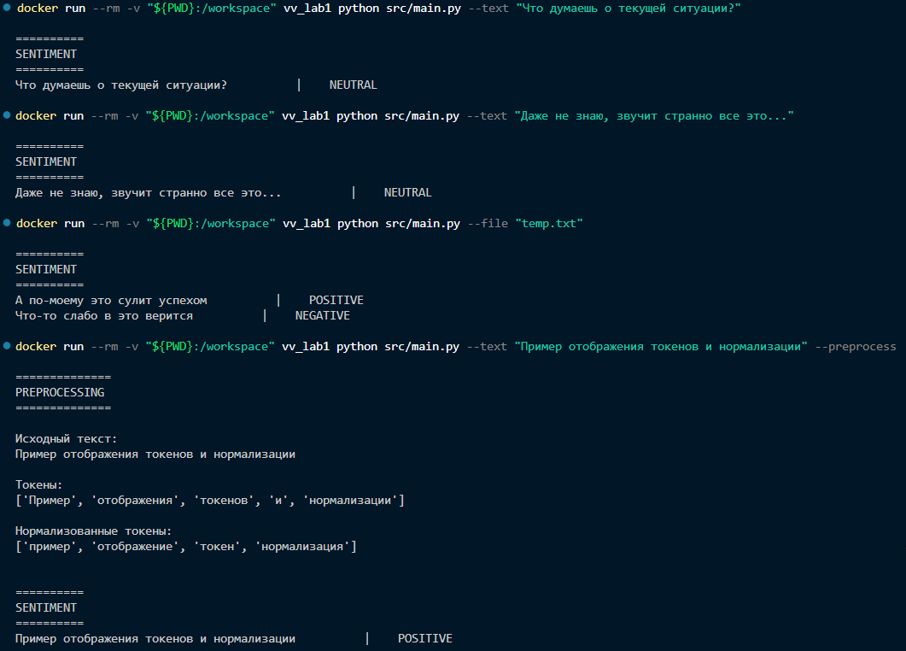

# Анализатор тональности текста на естественном языке

## Структура

В директории [src](./src/) находятся основные структуры:
- [Tokenizer](./src/tokenizer.py) - представляет собой регулярное выражение
    для выделения слов и чисел;
- [Normalizer](./src/normalizer.py) - загружает и фильтрует стоп-слова,
    приводит токены к нижнему регистру и выделяет леммы токенов;
- [Sentiment](./src/sentiment.py) - содержит класс модели наивного байесовского классификатора
    с предварительным этапом TF-IDF векторизации;
- [Train](./src/train.py) - модуль загрузки и обучения модели;
- [Main](./src/main.py) - CLI-модуль для запуска.

В [models](./models/) лежит обученная на русском датасете из Kaggle модель, которая будет
загружаться при выполнении.

## Запуск

Запуск выполяется в **Docker** по следующим шагам:
1. `docker build -t vv_lab1 .` - собрать образ в текущей директории;
2. `docker run --rm -v "${PWD}:/workspace" vv_lab1 python src/main.py`

    Для запуска необходимо указать либо флаг `--text "<текст>"`,
    либо `--file <путь>` (в этом случае он должен лежать в текущей директории,
    так как она монтируется для удобства). Для файла каждая строка будет разбираться
    отдельно.

    

3. `docker rmi vv_lab1` - в конце для удаления образа.

## Обучение

Для обучения необходимо разместить датасет в текущей директории и указать до него путь
в константах [train.py](./src/train.py). Ожидается файл *csv* с двумя колонками: текст и метка
(их названия и способ преобразования **LABEL_MAP** также можно указать). Сложные
предобработки не предусмотрены.

## Результат

В [примере](./images/example.png) (изображение выше) показан результат работы.
Модель простая, поэтому ей сложно разбираться хорошо в русском языке, но длинные
предложения дались лучше коротких.
На тестовых данных точность дошла до 67%, тогда как корреткность определения
негативного и позитивного классов была по 80%: нейтральный класс оттянул на
себя ситуацию с общей точностью.
