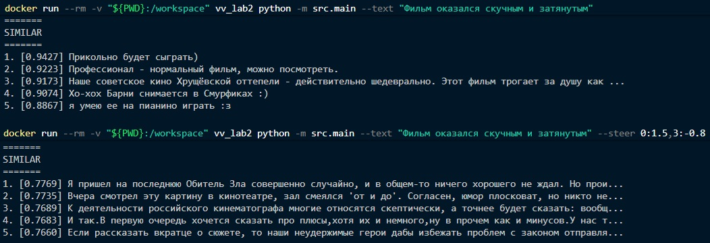

# Первый прототип семантического анализатора естественного языка

## Структура

В директории [src](./src/) находятся основные структуры:
- [Tokenizer](./src/tokenizer.py) - регулярное выражение для выделения слов и чисел
    (копия из Lab-1);
- [Normalizer](./src/normalizer.py) - стоп-слова, нижний регистр и леммы токенов
    (копия из Lab-1);
- [LSA](./src/lsa.py) - TF-IDF векторизация, TruncatedSVD (векторы тем) и
    query steering в пространстве тем;
- [Train](./src/train.py) - модуль обучения модели;
- [Main](./src/main.py) - CLI-модуль для запуска.

В [models](./models/) лежит обученная LSA-модель, которая загружается при выполнении.

Для обучения использовались те же данные, что и в Lab-1.


## Запуск

Запуск выполняется в **Docker** по следующим шагам:
1. `docker build -t vv_lab2 .` - собрать образ в текущей директории;
2. Обучение (если модели еще нет):
    `docker run --rm -v "${PWD}:/workspace" vv_lab2 python -m src.train`

3. `docker run --rm -v "${PWD}:/workspace" vv_lab2 python -m src.main`

    Для запуска необходимо указать либо флаг `--text "<текст>"`,
    либо `--file <путь>` (в этом случае он должен лежать в текущей директории,
    так как она монтируется для удобства). Для файла каждая непустая строка
    разбирается отдельно.

    Примеры:

    ```bash
    docker run --rm -v "${PWD}:/workspace" vv_lab2 python -m src.main --text "Фильм оказался скучным и затянутым"
    docker run --rm -v "${PWD}:/workspace" vv_lab2 python -m src.main --text "Фильм оказался скучным и затянутым" --steer 0:1.5,3:-0.8
    docker run --rm -v "${PWD}:/workspace" vv_lab2 python -m src.main --file example.txt
    ```

4. `docker rmi vv_lab2` - в конце для удаления образа.


### Примеры работы




## Обучение

Для обучения необходимо разместить датасет в `data/dataset.csv` и при необходимости
указать путь в константах [train.py](./src/train.py). Ожидается файл *csv* с колонкой
текста (`TEXT_COL`). Если строк больше `MAX_DOCS`, берется случайная выборка.
Число тем задается `N_COMPONENTS`. Сложные предобработки не предусмотрены.


## Результат

Для каждого входа CLI печатает полный разбор:
- **PREPROCESSING** - исходный текст, токены и леммы;
- **TF-IDF** - топ терминов запроса и их веса;
- **TOPIC VECTOR** - координаты документа в пространстве тем SVD;
- **TOPICS** - топ-слова наиболее выраженных тем;
- **STEERING** - только при `--steer`: вектор до и после сдвига координат тем;
- **SIMILAR** - ближайшие документы корпуса по cosine в LSA-пространстве
    (после steering, если он задан).

Query steering задается как `--steer id:weight,...` и прибавляет веса к координатам
тем запроса. После сдвига вектор снова L2-нормализуется перед поиском соседей.
